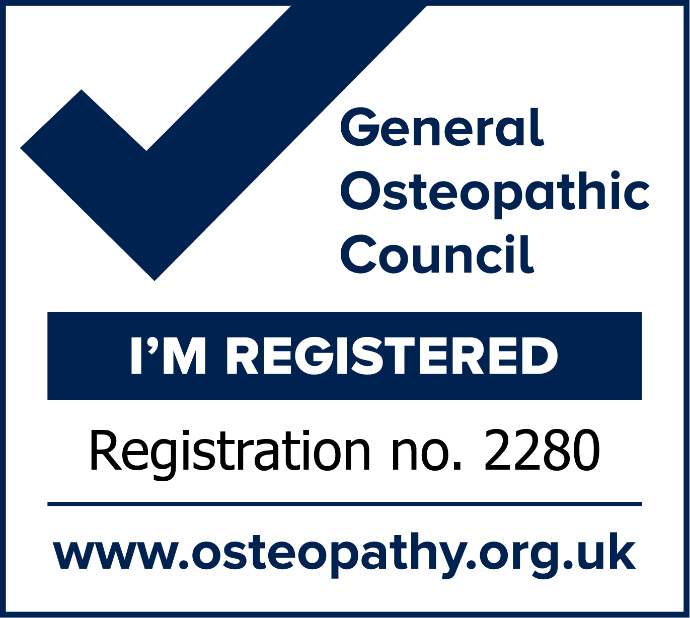
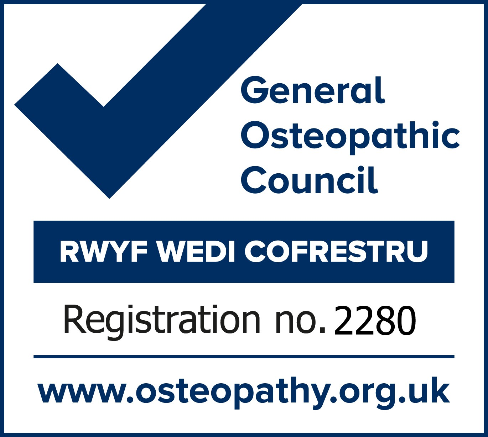

# Osteopathy and Cranial Osteopathy in Wrexham with Diane Kane  
*Treating since 1996* 

### Tel: 07312 919840  

### A gentle approach for everyone
Using the principles of osteopathy and cranial Osteopathy, the gentle hands on approach I use is appropriate for all from babies to the elderly. I am an experienced and professional practitioner committed to the management of a wide range of issues. I see and help babies, children, pregnant women and all adults. 

### What can osteopaths treat 
- Back and neck pain
- Joint pains and stiffness
- Muscle spasms and pain
- Nerve pain
- Tension
- Issues around pregnancy
- Children and babies
- Sinus congestion
- TMJ dysfunction
- Headaches related to the neck

### Covid 19 Precautions
If you are experiencing a new continuous cough, a temperature and or a loss of taste and smell, have recently returned from an area where the virus is more prevalent, or have knowingly been in contact with someone with the virus, either phone for advice or book for after you have completed your isolation period. Social distancing measures and hand sanitizers are in place and the treatment room is cleaned between each appointment. The osteopath will be wearing PPE and we ask that the patient also wears a mask. Thank you.

{: width="125"} {: width="125"}
