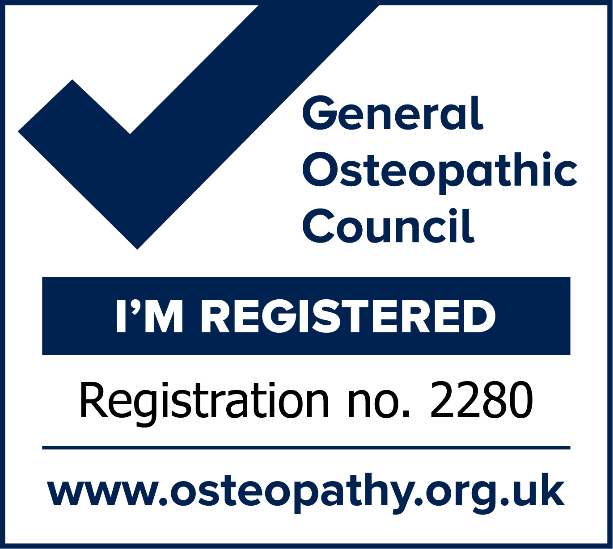
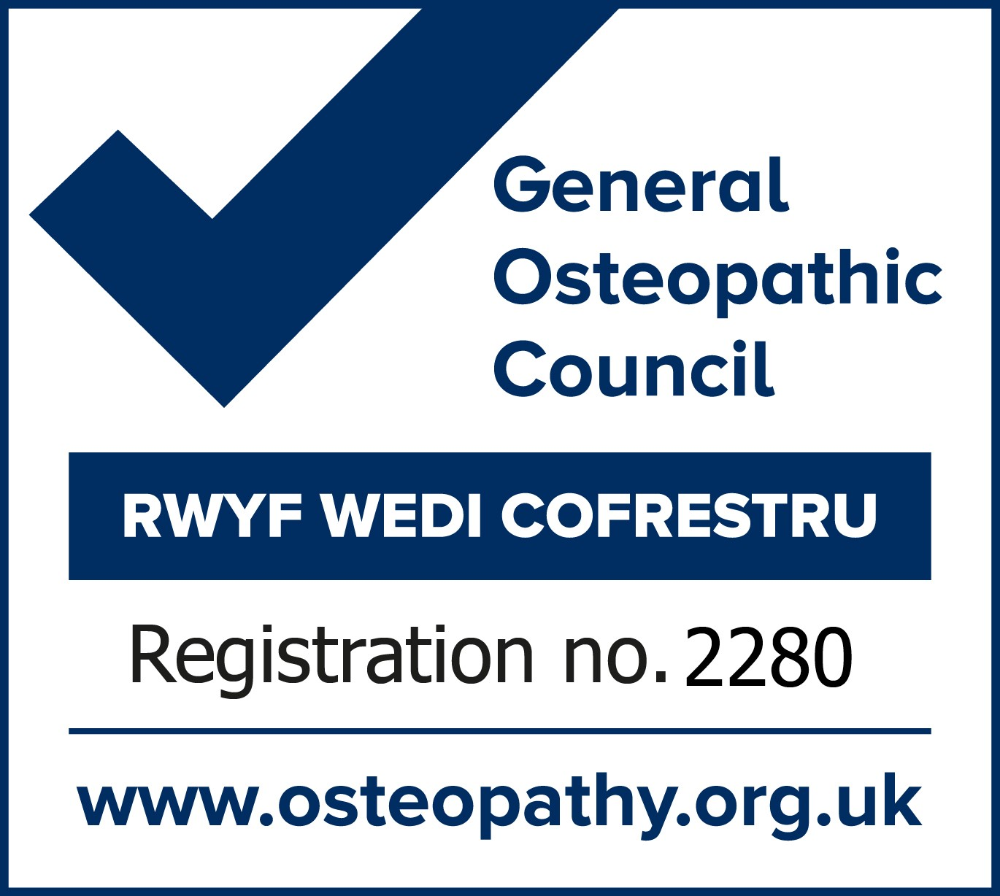

# Osteopathy and Cranial Osteopathy in Wrexham with Diane Kane  
*Treating since 1996* 

### Tel: 07312 919840  

### A gentle approach for everyone
Using the principles of osteopathy and cranial Osteopathy, the gentle hands on approach I use is appropriate for all from babies to the elderly. I am an experienced and professional practitioner committed to the management of a wide range of issues. I see and help babies, children, pregnant women and all adults. 

### What can osteopaths treat 
- Back and neck pain
- Joint pains and stiffness
- Muscle spasms and pain
- Nerve pain
- Tension
- Issues around pregnancy
- Children and babies
- Sinus congestion
- TMJ dysfunction
- Headaches related to the neck

### Health Precautions
If you have any signs of being unwell, please reschedule your appointent.

{: width="125"} {: width="125"}
